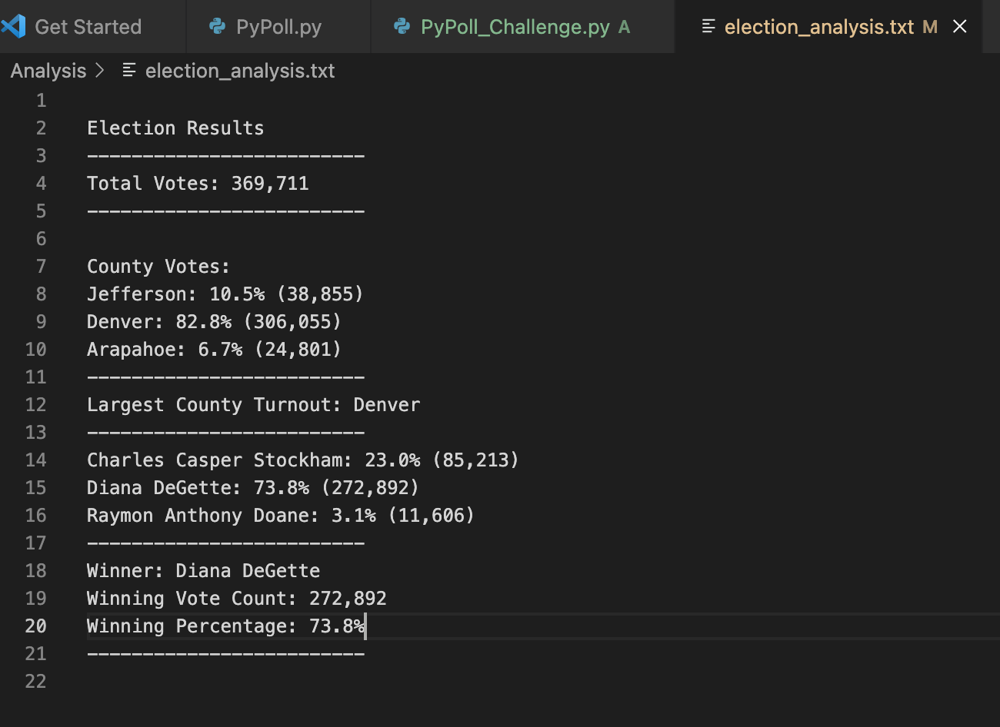
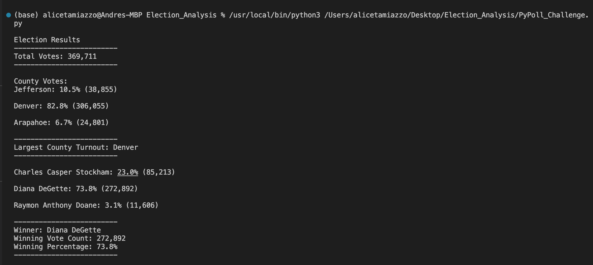

# Election_Analysis
## Challenge Overview
A colorado Board of Election employee has given you the following tasks to complete the election audit of recent 
local congressional election. 

1. Calculate the total number of votes cast 
2. Get the complete list of counties 
3. Calculate the total number of votes by county 
4. Calculate the percentage of votes for each county 
5. Determine the largest turnout county 
6. Get a complete list of candidates who received votes 
7. Calculate the total number of votes for each candidate received
8. Calculate the percentage of votes each candidate won 
9. Determine the winner of the election based on popular vote 

## Resources
- Data Source: election_results.csv
- Software: Python 3.9.12, Visual Studio Code 1.70.1

## Results
The analysis of the election show that:
- There were 369,711 votes cast in the election:
- The counties were:
  - Jefferson
  - Denver
  - Arapahoe
- The counties results were:
  - Jefferson had 10.5% and 38,855 number of votes
  - Denver had 82.8% and 306,055 number of votes
  - Arapahoe had 6.7% and 24,801 number of votes
**The largest turnout county was Denver**
- The candidates were:
  - Charles Casper Stockham
  - Diana DeGette
  - Raymon Anthony Doane
- The candidates results were:
  - Charles Casper Stockham received **23.0%** of the votes and **85,213** number of votes
  - Diana DeGette received **73.8%** of the votes and **272,892** number of votes
  - Raymon Anthony Doane received **3.1%** of the votes and **11,606** number of votes
- The winner of the election:
**Diana DeGette received 73.8% of the votes and 272,892 number of votes**

## Challenge Summary 
The script refers to elections, so it can be used to analyze other types of elections, such as presidential elections. 
To do the presidential election analysis, it is necessary to change the variable from county to state, being able to visualize 
the winner in each state. On the other hand, it also can create a new election party variable to observe the votes of parties in each state, 
which can impact the future of public laws in the country.

## Text file results 
.

## Terminal results 
.

